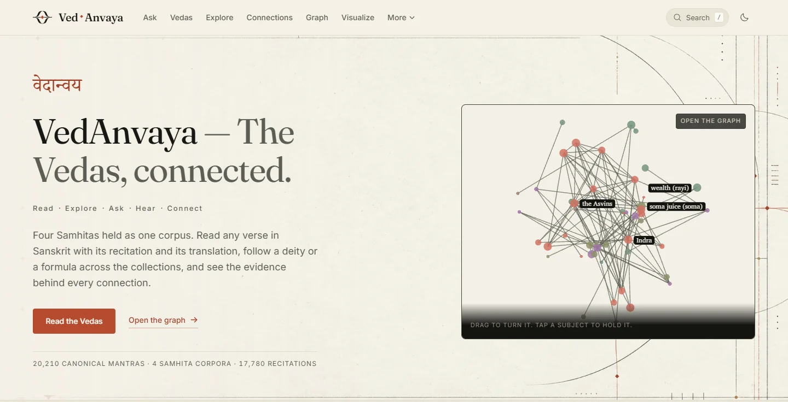
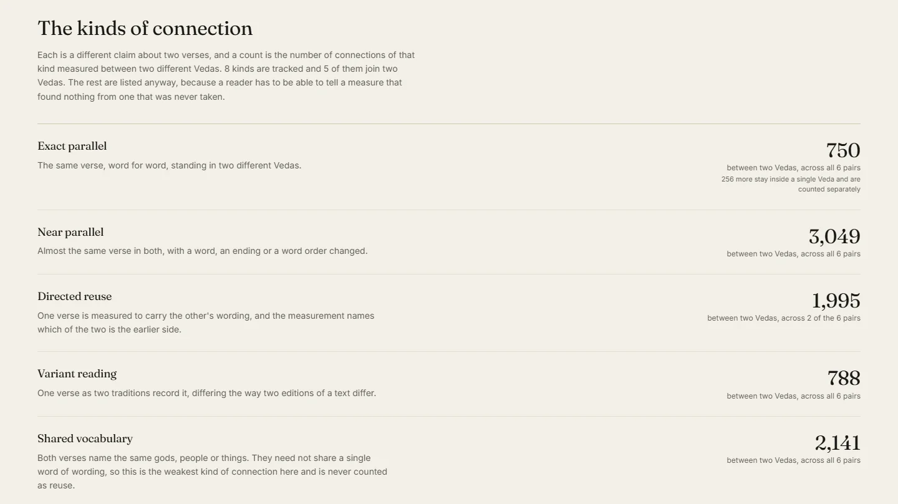
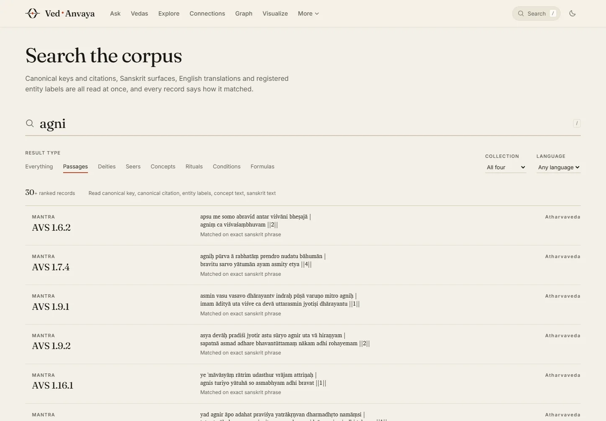
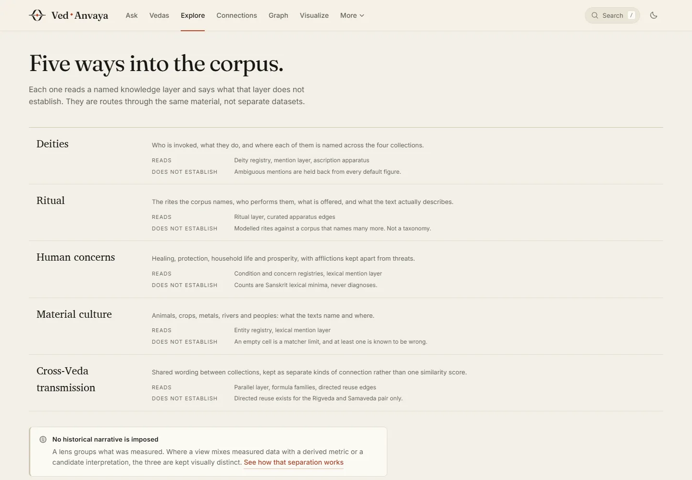
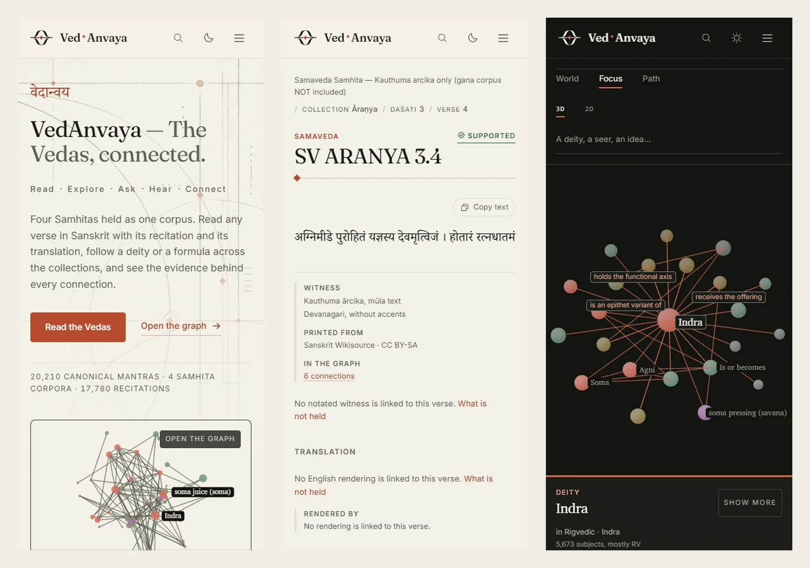
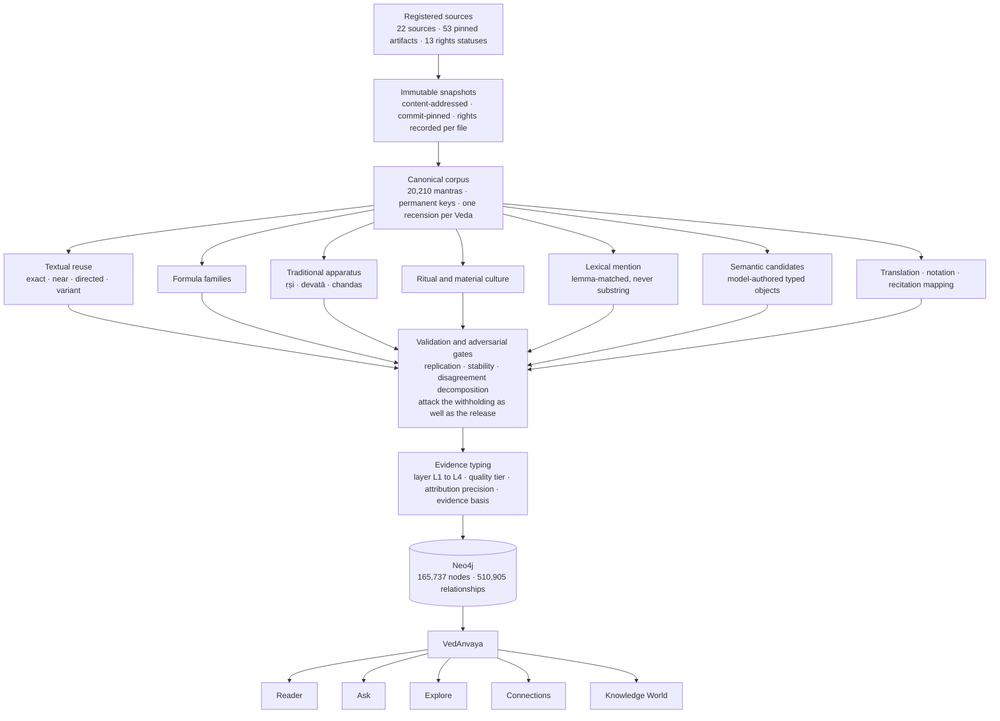
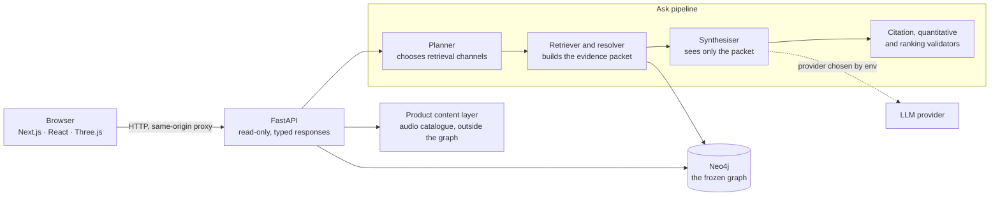

<div align="center">


<h1>VedAnvaya</h1>

<p><strong>वेदान्वय — The Vedas, connected.</strong></p>

<p>
An evidence-led digital atlas for <strong>reading</strong>, <strong>hearing</strong>,
<strong>questioning</strong> and <strong>navigating</strong> the relationships that run
across the Vedic corpus — with the evidence, and the limit of that evidence, attached to
every figure it shows.
</p>

<p>


</p>

</div>



---

## Contents

[Overview](#what-vedanvaya-is) ·
[The numbers](#the-numbers) ·
[Product tour](#product-tour) ·
[The knowledge graph](#vedagraph-building-the-knowledge-graph) ·
[Evidence model](#evidence-before-inference) ·
[The Samaveda](#the-samaveda-a-corpus-that-tests-the-rules) ·
[Architecture](#architecture) ·
[Technology](#technology) ·
[Run it locally](#run-it-locally) ·
[Repository map](#repository-map) ·
[Project story](#how-this-got-here) ·
[A personal note](#a-personal-note) ·
[License](#license)

---

## What VedAnvaya is

The Vedas are usually met one verse at a time, in a book, in order. That is the right way to
read them and a poor way to *see* them. A hymn to Agni in the first maṇḍala of the Rigveda is
connected to a verse in the Samaveda that reuses it, to a formula that turns up in the
Atharvaveda, to a metre it shares with hundreds of other hymns, and to a seer whose family
composed a whole book. None of that is visible on the page.

VedAnvaya makes it visible **without making it up**. Four Saṃhitās are held as one corpus,
every verse has a permanent address, and every connection between two verses is one of a small
number of *stated kinds* — an exact parallel, a directed reuse, a shared formula, a named
deity, a traditional ascription — each carrying its own scope and its own evidence. There is
no single similarity score anywhere in the product, because the things it would average are
not degrees of one quantity.

| | |
|---|---|
| **Read** | Any verse of the four Saṃhitās: accented Sanskrit, the witness it was printed from, alternate readings, translation where one exists, and the apparatus in the margin |
| **Hear** | A recitation for the individual verse, mapped to that verse and checked against its text — never a hymn-length file standing in for a line |
| **Ask** | Questions in English, answered only from retrieved graph evidence, every claim cited, and `INSUFFICIENT_EVIDENCE` instead of a confident guess |
| **Explore** | Five lenses — deities, ritual, human concerns, material culture, cross-Veda transmission — each naming what it reads *and* what it does not establish |
| **Connect** | Typed textual relationships between the four collections, measured pair by pair, plus formula families traced through the corpus |
| **Visualise** | A three-dimensional knowledge world with World, Focus and Path modes, and a keyboard-accessible textual alternative |

Everything above is bounded by one recension per Veda and by a Saṃhitā-only scope.
**[`PRODUCT_V1_SCOPE.md`](PRODUCT_V1_SCOPE.md) states those boundaries in full** — read it
before treating any count here as a statement about "the Vedas". Three of the four Saṃhitās
are partial in ways their traditional names do not reveal.

---

## The numbers

Measured against the certified graph. Every figure here is read from the running product or
from the release certification, not typed from memory.

| | | |
|---|---:|---|
| **Canonical mantras** | **20,210** | Every verse addressed by a canonical key and a canonical citation |
| **Saṃhitā corpora** | **4** | Rigveda, Samaveda, Yajurveda, Atharvaveda — one recension each |
| **Graph nodes** | **165,737** | Of which 71,773 are public, addressable subjects |
| **Relationships** | **510,905** | Every one graded; 272,373 are public |
| **English translations** | **18,427** | Plus 194 renderings reused from a verified parallel and labelled as reuse |
| **Verse recitations** | **17,780** | One recording per verse, mapped to an exact key and text-checked |
| **Samavedic notation witnesses** | **1,136** | Verses carrying source-printed svara marks, validated against the printed witness |
| **Cross-Veda links** | **8,723** | Across six corpus pairs, of which 6,582 are literal textual reuse |

Named subjects, counted apart rather than summed — one subject can be a metal, a substance and
a concept at once:

**157** deities · **616** seers · **87** seer families · **575** metres · **384** concepts ·
**103** rites · **4,825** formulas · **720** formula families · **1,485** derived metrics

### The four corpora

| Collection | Recension | Verses | Translated | Recited |
|---|---|---:|---:|---:|
| **Rigveda** ऋग्वेद | Śākala | 10,552 | 10,480 | 10,552 |
| **Samaveda** सामवेद | Kauthuma (ārcika) | 1,844 | *reused renderings only* | *none released* |
| **Yajurveda** यजुर्वेद | Śukla, Vājasaneyi Mādhyandina | 1,975 | 1,950 | 1,777 |
| **Atharvaveda** अथर्ववेद | Śaunaka | 5,839 | 5,715 | 5,451 |

No Brāhmaṇa, no Āraṇyaka, no Upaniṣad. No second recension of any Veda. The Samavedic gāna
corpus — the *sung* body, and the larger one — is not held, and no figure here should be read
as a Samavedic total. The full accounting, including what each exclusion means for a zero you
might see in the product, is in [`PRODUCT_V1_SCOPE.md`](PRODUCT_V1_SCOPE.md).

> **On the recitations.** 17,780 recordings are catalogued and each is mapped to its verse and
> checked against that verse's text automatically. **20 of them have been listened to by a
> person**; the other 17,760 have not, and the product never describes them as human-verified.
> The Samaveda has no catalogued recitation at all, because none is published anywhere that
> maps to individual ārcika verses.

---

## Product tour

### Read like a critical edition


Every verse is a folio. The Sanskrit carries its accents and names the witness it was printed
from and the terms that witness is held under. The margin separates what the *traditional
apparatus ascribes* to the hymn — deity, seer, metre — from what is *named inside this verse*,
because those are different claims and collapsing them makes one of them unaskable. Alternate
witnesses open as a collation column; parallels, formulas and connected passages are one click
from the text; the shelfmark at the foot gives the canonical key and citation.

### Hear the verse, not the hymn

The recitation player is attached to the individual verse. The line it draws is a trace of the
accent marks that verse actually prints — **not** measured pitch, and not a house waveform
reused on every recording. Where no mapping survived verification, the reader says so instead
of offering a neighbouring file.

### Read the Samaveda as notation, not as melody


### Ask, and inspect the evidence


Retrieval runs first and the model sees **only** what retrieval found. Every factual sentence
carries a marker into the item it came from, and each marker opens that item's Sanskrit,
translation and canonical citation, so an answer can be checked rather than trusted. A question
this build cannot answer returns `INSUFFICIENT_EVIDENCE` and names the dimension it could not
reach; it does not guess, and it does not turn a gap in the graph into a confident denial about
the Vedas.

Over the formal 60-question benchmark: **39 supported-correct, 4 partial, 17 correctly refused,
0 misleading, 0 hallucinated**, with every citation resolving to a real retrieved item.

### Navigate the knowledge graph


**World** shows the whole public graph; **Focus** holds one subject and its neighbourhood, with
every edge labelled by the kind of claim it is; **Path** traces a route between two subjects and
draws it as a chain. Both a 3D and a planar renderer are available, and a keyboard-accessible
textual alternative carries the same information for anyone who cannot use the canvas.

### See what the four collections share



Five measured kinds, kept apart. An **exact parallel** is the same verse word for word in two
Vedas. A **near parallel** changes a word, an ending or the order. A **directed reuse** is a
measurement that also names which of the two is the earlier side — and it exists for two corpus
pairs only, with the other four stating why the measurement declined to name a direction. A
**variant reading** is one verse as two traditions record it. **Shared vocabulary** means the two
verses name the same gods, people or things and need not share a word of wording, so it is the
weakest kind here and is never counted as reuse.

Eight kinds are tracked and only five of them join two Vedas. The other three are listed
anyway — one that stays inside a single collection, one marked `NEVER MEASURED`, and one that
is not a pair relation at all — because a reader has to be able to tell a measure that found
nothing from a measure that was never taken.

### Find anything, and see how it matched



### Five ways in



### On a phone



---

## VedaGraph: building the knowledge graph

The project began in September 2026 as **VedaGraph**, and it was a database problem before it
was anything else. The first question was not what to show but what could honestly be loaded:
which editions exist, what they are licensed under, whether two witnesses to the same verse
agree, and what a canonical citation should even be for a corpus whose four collections number
their contents four different ways.

Nothing here was produced by running one language model over twenty thousand verses and keeping
what came back. The graph was assembled in stages, and the stages were run as **parallel lanes
with adversarial review between them** — a working method the repository still carries in its
own files: per-corpus lanes that may not write each other's output, shared contract files with a
**single writer**, an independent rights reviewer who alone makes a licensing determination, and
a QA lane that re-runs every other lane's gate rather than trusting its self-report. One of
those orchestration notes is committed at
[`docs/work_packets/CANONICAL_SANSKRIT_CLOSURE_ORCHESTRATION.md`](docs/work_packets/CANONICAL_SANSKRIT_CLOSURE_ORCHESTRATION.md);
a later closure sprint assigned every open gap to exactly one owning lane, with no unassigned
rows.



**What each stage actually does**

1. **Pin the source.** A file, not a website. Each of the 53 artifacts carries a checksum, a
   retrieval record and a rights status — and 13 controlled statuses say what may be done with
   each, down to whether a derived file may be redistributed.
2. **Build the canonical corpus.** Snapshot → staging → normalization → source assertion →
   field-specific reconciliation → QA → canonical JSONL plus a manifest. Conflicting claims are
   *retained*, not resolved away. Rebuilds are byte-identical.
3. **Run the analyses in parallel.** Reuse detection, formula families, the traditional
   apparatus, ritual and material culture, lexical mention, translation alignment, notation
   alignment and recitation mapping are separate layers over the finished corpus, each
   rebuildable on its own and none of them allowed to write another's records.
4. **Let models propose, never decide.** Model-assisted extraction produces *candidates*:
   35,131 semantic assertions live in the graph as a permanently candidate layer, and the six
   interpretive claims each carry the observation that would falsify them. Fuzzy matching may
   write a candidate record for a human; it may not write an alias and it may not write an edge.
5. **Attack the result.** Extraction runs were replicated and their disagreements decomposed;
   the ontology was rebuilt three times and frozen once, each rebuild forced by an adversarial
   pass that found a new stratum the model had been quietly wrong about. The release gates
   attack the *withholding* too: a row held back has to state a reason the repository cannot
   disprove.
6. **Type the evidence, then load.** Every edge is graded before it reaches Neo4j, and an edge
   whose layer is unknown grades to the weakest tier rather than to a flattering default.

> [!IMPORTANT]
> **Models do not establish textual fact here.** Model-assisted output is candidate material.
> It is typed as such, it is counted separately, and it is never promoted into a source-explicit
> claim. See [ADR-006](docs/decisions/ADR-006-no-llm-canonical-output.md),
> [ADR-014](docs/decisions/ADR-014-llm-output-is-candidate-only.md) and
> [ADR-015](docs/decisions/ADR-015-typed-semantic-object-occurrences.md); the extraction prompts
> themselves are tracked in [`prompts/`](prompts/).

The full engineering record — every build command, every layer's rules and evidence, and the
CLI — is in [`docs/BUILDING_THE_CORPUS.md`](docs/BUILDING_THE_CORPUS.md).

---

## Evidence before inference

This is the part of the project that took the longest, and the part that decides what the rest
is worth. Every claim in the graph is typed by **how it came to be**, and the four layers are
never collapsed into one another.

| Layer | What it means | Graded | Edges |
|---|---|---|---:|
| **L1 · Source-explicit** | A source states it: a quoted text, a traditional index ascription, a published translation | `TIER_A` | 109,262 |
| **L2 · Deterministic derived** | A reproducible rule over stored text or over L1 produced it — including projecting a hymn's label onto its verses | `TIER_B` | 396,497 |
| **L3 · Model-assisted** | A language model read evidence and *proposed* it. Permanently candidate | `TIER_C` | 598 |
| **L4 · Interpretive** | A reading held by this project or a named commentator, each carrying its own falsifier | `TIER_D` | 4,548 |

Four distinctions follow from that, and the product enforces all four:

- **Attribution is not textual mention.** The Anukramaṇī assigns a deity to a *hymn*; that is
  not a statement that any particular verse names it. Both are held, counted separately, and
  labelled `PER_PASSAGE`, `CONTAINER_INHERITED` or `TEXTUAL_MENTION` so a reader can choose
  which question they are asking. `pavamānaḥ somaḥ` is assigned to 1,087 mantras and mentioned
  in none.
- **Reuse is not similarity.** Every cross-Veda link states its kind. Nothing averages them
  into a score, and shared vocabulary is never counted as reuse.
- **Normalization is not identity.** Folding accents and orthography is a comparison instrument
  for search and alignment. It is not, on its own, evidence that two strings are the same word:
  `aśvaḥ` and `aśvāḥ` share an ASCII fold and stay two entities.
- **Absence from a predicate is not absence from the text.** `NOT_BUILT` means the layer does
  not exist here and the silence is ours. `INSUFFICIENT_EVIDENCE` means evidence exists and
  cannot support the claim — it is **not** a zero. `PARTIAL` means a real answer over part of
  the corpus. An empty result claiming `SUPPORTED` raises rather than renders.


Every surface states its own scope in a clause and links to that page. It is one of the larger
things in the product, on purpose.

---

## The Samaveda: a corpus that tests the rules

The Samaveda is the corpus where every rule above has to earn itself, because the Samaveda is
*defined* by its sung realisation and this build holds the verse text rather than the song.

- The **Kauthuma ārcika** is the canonical text: 1,844 verses across four collections, each with
  a canonical key.
- **1,136 verses carry source-printed svara notation**, aligned to the verse and validated
  through three gates — including one that attacked the *withheld* rows rather than only the
  released ones. The marks are reproduced as the witness prints them. **No pitch, interval or
  melody is reconstructed from them**, and the reader says so beside the notation.
- Where a Samavedic verse is a **character-identical parallel of a Rigvedic one**, the published
  English rendering of that Rigvedic verse is shown — labelled *via the verified Rigvedic
  parallel*, sourced to the verse it came from, and never presented as a translation of the
  Samavedic corpus. 173 verses qualify. The other 1,671 show a typed absence.
- **The gāna corpus is not held.** No gāna work is modelled and no `MUSICALIZED_AS` relation is
  asserted. 708 notation rows that could not be aligned are withheld rather than attached.
- **No Samavedic recitation is catalogued**, because none is published anywhere that maps to
  individual ārcika verses. The product prints that sentence rather than rendering a silent zero.

Any claim that this project "has the Samaveda" while holding only the ārcika would be false, and
the corpus manifest says so in its own words.

---

## Architecture



Three processes: Neo4j in Docker holding the graph, a read-only FastAPI service, and a Next.js
frontend that talks only to the backend and never to Neo4j. The product degrades rather than
failing — with no LLM key, browsing, search, the graph, cross-Veda comparison and audio all work
and Ask reports `NOT_CONFIGURED`; with Neo4j down, the API still answers `/health` and knowledge
routes return 503 with a body that names no hostname.

Deeper material: [`docs/architecture/`](docs/architecture/),
[`docs/decisions/`](docs/decisions/) and, for the frontend's design contract,
[`frontend/DESIGN.md`](frontend/DESIGN.md).

---

## Technology

| | |
|---|---|
| **Frontend** | Next.js 16 · React 19 · TypeScript 5 · Tailwind CSS 4 with a token-governed CSS layer · Three.js for the 3D knowledge world · `d3-force-3d` and `graphology` for layout and community detection · Radix UI · Phosphor icons · `next-themes` |
| **Backend** | Python 3.12 · FastAPI · Pydantic 2 and `pydantic-settings` · Uvicorn · `httpx` · `orjson` · `tenacity` · Typer for the CLI · Rich |
| **Knowledge graph** | Neo4j 5.26 Community, in Docker · hand-written Cypher, typed at the repository boundary, with no OGM · Graph Data Science is optional and produces only `analytics_`-prefixed derived measures that nothing downstream treats as evidence |
| **Corpus and NLP** | `lxml` and BeautifulSoup for TEI and HTML sources · `indic-transliteration` behind a replaceable Devanāgarī → IAST wrapper · project-owned Unicode NFC and accent-aware comparison profiles · `PyYAML` registries |
| **Ask** | Provider-agnostic by environment variable: Gemini, OpenAI, Anthropic, Groq, OpenRouter, xAI, or any OpenAI-shaped endpoint. Gemini needs no vendor SDK; the others install as an extra |
| **Tooling** | `uv` · `pnpm` · `ruff` · `mypy --strict` · `pytest` · `vitest` · Playwright · `openapi-typescript` to generate the frontend's API types from the live schema |

No vector database and no embedding retrieval. Language models are used to *build candidate
evidence* and to *synthesise answers over retrieved evidence*; they are not a runtime dependency
of anything else in the product.

---

## Run it locally

You need **Python 3.12+**, [**uv**](https://docs.astral.sh/uv/), **Node 20+**, **pnpm 10** and
**Docker**.

```powershell
git clone https://github.com/HimanshuMohanty-Git24/VedAnvaya.git
cd VedAnvaya

copy .env.example .env               # then set NEO4J_PASSWORD
uv sync --extra dev --extra ask      # Python environment (drop --extra ask to skip Ask)
cd frontend; pnpm install; cd ..     # frontend dependencies

docker compose -f infra\docker-compose.neo4j.yml up -d               # the graph store
powershell -ExecutionPolicy Bypass -File scripts\doctor.ps1          # check everything
powershell -ExecutionPolicy Bypass -File scripts\start-product.ps1   # run it
```

Then open **<http://localhost:3000>**. The API is on <http://127.0.0.1:8000> with interactive
docs at `/docs`. Stop with `scripts\stop-product.ps1`, which never touches Neo4j.

`doctor.ps1` checks the Python environment, the frontend install, Neo4j connectivity *and
whether the corpus is actually loaded*, the LLM configuration, the audio catalogue and the
ports — and names whichever one is wrong. It never prints a secret value.

> [!WARNING]
> **A fresh clone does not arrive with the graph.** There is no automatic bootstrap and this
> repository does not pretend otherwise. `.gitignore` excludes the canonical, knowledge, derived,
> staged and raw corpus records — deliberately, because individual assets carry different
> rights — so `scripts/build_neo4j_projection.py` has nothing to read on a new machine. A working
> VedAnvaya needs a preloaded Neo4j volume, a Neo4j dump restored into the container, or a full
> rebuild of the corpus from pinned sources. Without one of those, `doctor.ps1` reports
> `neo4j-loaded FAIL` and every count the product shows would be a false zero.

**[`LOCAL_SETUP.md`](LOCAL_SETUP.md) is the canonical guide** — prerequisites, every environment
variable, the three services and their start order, health checks that distinguish "it started"
from "it works", and how to stop everything safely.

---

## Repository map

```text
frontend/      Next.js product UI, its design system and its audits
src/vedagraph/ backend, domain model, ingestion, enrichment, semantic and Ask pipelines
  ├ api/         FastAPI app, routes, repositories and the Ask pipeline
  ├ domain/      the ontology, evidence tiers, entity and figure contracts
  ├ ingest/      source adapters, staging and reconciliation
  ├ enrich/      the derived layers: reuse, formulas, morphology, cross-Veda, ritual
  ├ semantic/    model-assisted extraction, packets, validation, replication, review
  └ graph/       the Neo4j projection
data/          registries, canonical records, product content, evidence and gap registry
  └ registry/    the reviewed contracts: sources, artifacts, rights, works, entities
scripts/       ingestion, build, audit and release tooling; the launchers
schemas/       generated JSON Schema for every canonical record type
docs/          architecture, decisions (ADRs), reports and work packets
tests/         the offline suite, plus the gates that need a live graph
prompts/       the tracked extraction prompts, versioned
infra/         the Neo4j compose definition
```

---

## How this got here

It started with questions that were not exotic and that no available tool would answer. Which
deity does the Atharvaveda actually invoke most, once you account for it being a little over
half the size of the Rigveda? Which Rigvedic verses does the Samaveda take, and does it change
them? What does the corpus name when it talks about illness, and is a demon in that list?

Each of those is answerable, and each is answerable *wrongly* in a way that looks fine. An early
version of this project asked what conditions the corpus addresses and returned a confident
ranked list whose top entries were demons and sorcery. The numbers were correct. The answer was
not, because the question was about illness and the data was about everything a verse asks
protection from. Fixing it meant typing every condition in the registry as an affliction, a
threat or a named cause.

So the project is as much about the failure modes as about the corpus, and it grew roughly in
this order:

**corpus engineering** → **provenance and rights** → **a canonical key for every verse** →
**the traditional apparatus** → **the lexical mention layer** → **cross-Veda relationships** →
**evidence-aware Ask** → **a modern reading interface**

The name changed last. *VedaGraph* described the technique, and by the time there was a reader,
a recitation player and a graph you could walk through, the technique was no longer the thing.
*VedAnvaya* describes what a person does with it: **अन्वय**, *anvaya*, is the grammarian's word
for the thread you follow to resolve a sentence — the order in which the words actually connect,
as opposed to the order in which they are written. The internal identifiers still say `VG:`, and
they will keep saying it: renaming a stable identity to match a brand is how you lose the ability
to compare two builds.

VedAnvaya is an independent personal research and engineering project by **Himanshu Mohanty**,
begun in September 2026 and still being worked on. It is not an institutional edition of the
Vedas, and it does not claim to replace traditional study, philology or scholarship. If you are
a scholar and something here is wrong, that would genuinely be worth knowing — most of the errors
caught so far were caught by taking a confident-looking answer and asking what question it was
actually answering.

---

## A personal note

This project means a great deal to me, and I would rather say so plainly than leave it out.

I offer this work with gratitude to **Lord Viśvakarmā** (Vishwakarma), the divine craftsman —
the one invoked by those who make things — and to **Indra**, whose presence runs through so much
of this corpus that the graph could hardly be drawn without him at its centre.

I do not think of myself as the owner of the ideas this tradition carries. They were held,
transmitted and kept exact by people for many centuries before anyone wrote them down, and I am
grateful simply to have been an instrument through which one small way of looking at them could
be built.

*This is a personal reflection, and nothing in it is a claim VedAnvaya makes on behalf of anyone
who uses it.*

— **Himanshu Mohanty**

---

## License

VedAnvaya's original software is **source-available under the
[PolyForm Noncommercial License 1.0.0](LICENSE)**.

Noncommercial study, research, experimentation, modification and redistribution are permitted,
subject to the license terms. **Commercial use requires separate permission** from the copyright
holder.

This is deliberately *not* an OSI Open Source license. The Open Source Definition forbids a
license from restricting any field of endeavour, so no OSI-approved license can carry a
noncommercial condition. "Source-available" is the accurate description; "open source" would not
be.

The license covers the original VedAnvaya software and project material. It does **not**
relicense the Vedic texts, translations, scholarly editions, manuscript scans or recitation
recordings this project is built from — those remain under their own terms, and a derived file
inherits the constraints of the source it was derived from.
[**`LICENSE_SCOPE.md`**](LICENSE_SCOPE.md) states the boundary exactly, and the registries under
[`data/registry/`](data/registry/) record the terms artifact by artifact.

---

## Acknowledgements

This project is built on other people's work, and the registries name every piece of it with its
own terms. The ones it leans on most:

- **[GRETIL](https://gretil.sub.uni-goettingen.de/)**, Göttingen — the TEI Saṃhitā editions that
  are the primary Sanskrit text for most of this corpus.
- **[VedaWeb](https://github.com/VedaWebProject/vedaweb-data)**, Cologne — commit-pinned TEI, and
  the University of Zurich morphosyntactic annotation carried inside it: over a decade of hand
  annotation, corrected against Grassmann's dictionary, on which the whole lexical mention layer
  depends.
- **[Sanskrit Wikisource](https://sa.wikisource.org/)** and **[Wikisource](https://en.wikisource.org/)** —
  the Samavedic mūla and sāsvara witnesses, and the transcriptions of the public-domain
  translations.
- **[Akavarapu and Bhattacharya (2023)](https://github.com/mahesh-ak/WSC2023)** — the digital
  Anukramaṇī the traditional apparatus is built from.
- **Ralph T. H. Griffith** and **W. D. Whitney with C. R. Lanman** — the public-domain English
  renderings this product displays.
- **[VedSearch](https://vedsearch.org/)** — the per-verse recitations, streamed from the
  publisher and never redistributed here.
- The open-source projects the product runs on: **Next.js**, **React**, **Three.js**,
  **FastAPI**, **Pydantic**, **Neo4j**, **Tailwind CSS**, **uv**, **Ruff**, **mypy**, **pytest**,
  **Vitest** and **Playwright**.

The authoritative, artifact-by-artifact record is
[`data/registry/sources.yaml`](data/registry/sources.yaml),
[`data/registry/source_artifacts.yaml`](data/registry/source_artifacts.yaml) and
[`data/registry/rights.yaml`](data/registry/rights.yaml); the product's own `/sources` page
states the same thing for readers.

---

<div align="center">
<sub>

[Scope and limits](PRODUCT_V1_SCOPE.md) ·
[Release notes](RELEASE_NOTES_V1.md) ·
[Local setup](LOCAL_SETUP.md) ·
[Building the corpus](docs/BUILDING_THE_CORPUS.md) ·
[Architecture](docs/architecture/) ·
[Decisions](docs/decisions/) ·
[Status](docs/STATUS.md)

</sub>
</div>
